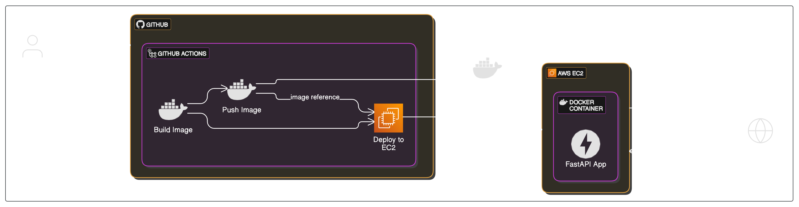

# 🚀 CI/CD Pipeline for FastAPI Application Deployment on AWS EC2 Using Docker and GitHub Actions

## 📌 Project Overview

This project demonstrates how to build, containerize, and automatically deploy a **FastAPI web application** using a full CI/CD pipeline. The entire process is automated via **GitHub Actions**, with deployment to an **AWS EC2** instance using **Docker**.

The purpose of this project is to gain hands-on experience with foundational DevOps tools while understanding modern deployment workflows.

---

## 🎯 Objective

- ✅ Build and containerize a simple FastAPI application
- ✅ Set up an EC2 server on AWS
- ✅ Create a GitHub Actions workflow for CI/CD
- ✅ Automate Docker image build and push to Docker Hub
- ✅ Deploy container on EC2 using SSH commands in workflow

---

## 🔧 Technologies Used

| Tool          | Purpose                           |
|---------------|-----------------------------------|
| **FastAPI**   | Lightweight Python web framework  |
| **Docker**    | Containerization of the app       |
| **GitHub**    | Source code repository            |
| **GitHub Actions** | CI/CD automation pipeline |
| **AWS EC2**   | Hosting the deployed container    |
| **Docker Hub**| Docker image registry             |

---

## 🧱 Features

- 🧩 FastAPI backend with two endpoints:
  - `GET /` – Returns “Hello from DevOps App”
  - `GET /health` – Health check
- 🐳 Dockerized application
- 🔄 CI/CD pipeline on GitHub Actions:
  - Builds Docker image
  - Pushes image to Docker Hub
  - Connects to EC2 and deploys container
- 🔐 Secure deployment using GitHub Secrets and SSH keys

---

## 🗺️ Architecture Diagram

